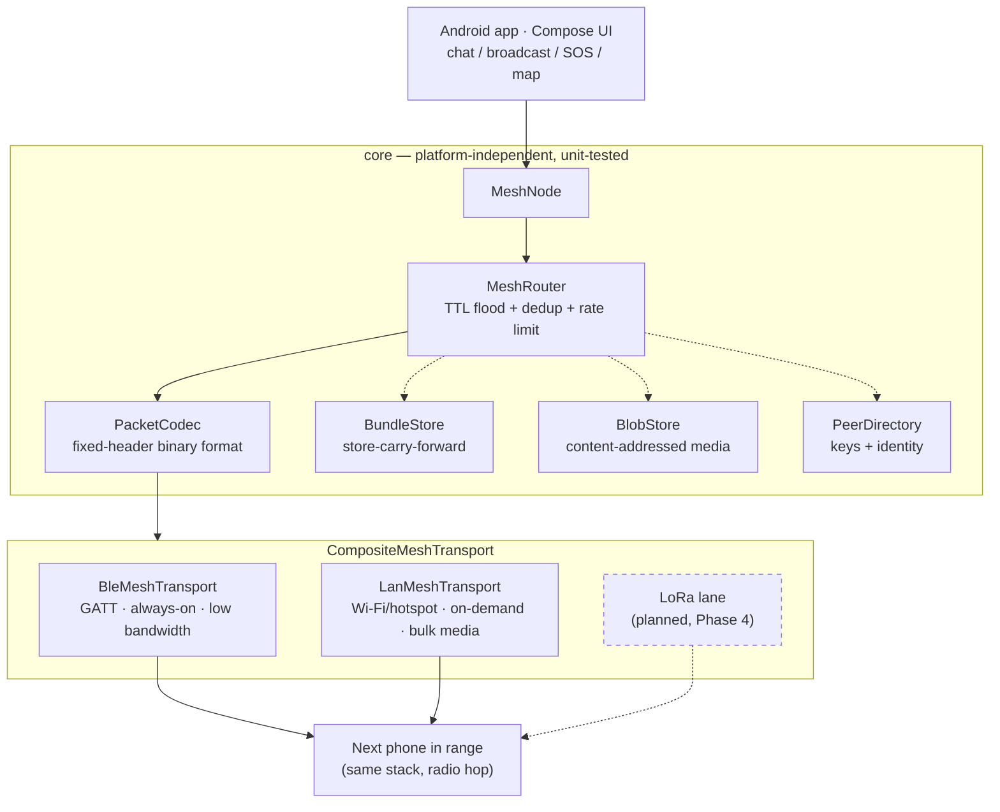

# Ping

**Chat, share location, and send photos/videos with no internet — built for emergencies.**

<!-- TODO: drop a 10-15s GIF/WebM here of two phones exchanging messages in Airplane
     Mode — this is the single highest-value thing missing from this README. Record it
     off the next two-phone test round; docs/TESTING.md has the setup. -->

Phone-to-phone mesh over Bluetooth LE (chat/GPS/SOS, multi-hop, store-carry-forward) with
on-demand Wi-Fi links for media, and optional LoRa nodes for kilometer-scale text range.
Every account is local-only — pick a callsign and password on-device (no server, no
recovery, same model as Briar/Signal Desktop) — see [docs/SECURITY.md](docs/SECURITY.md)
for exactly what that does and doesn't protect.

Ping is free software, licensed under the [AGPL-3.0](LICENSE), and open to
contributions — see [CONTRIBUTING.md](CONTRIBUTING.md) to get started.

**Status: pre-release (Phase 1 of 6), unaudited.** See [docs/VISION.md](docs/VISION.md)
for the roadmap (including the planned India civic reporting & legal-aid tier),
[docs/ARCHITECTURE.md](docs/ARCHITECTURE.md) for how the system fits together, and
[protocol/SPEC.md](protocol/SPEC.md) for the exact wire format.

## Modules

- `core/` — platform-independent Kotlin: wire codec, mesh relay (TTL flooding + dedup),
  DTN outbox, identity/crypto, content-addressed blob store. Heavily unit-tested.
- `tools/simulator/` — JVM mesh simulator: runs dozens of virtual nodes through churn,
  partition, and dense-crowd scenarios as JUnit tests.
- `tools/node/` — desktop mesh node (LAN lane): lets a laptop join the mesh, so the app
  can be tested with a single phone. See [docs/TESTING.md](docs/TESTING.md).
- `android/app/` — Android app: BLE + LAN transports, foreground mesh service, Compose UI.

## Architecture: one mesh, multiple radio lanes

Everything above `MeshTransport` — routing, store-carry-forward, crypto, the blob store —
is radio-agnostic and lives in `core/`. Each radio is a thin, swappable lane underneath it;
today that's BLE (always-on, low bandwidth) and LAN (on-demand, for bulk media), with a
LoRa lane planned for Phase 4. See [docs/ARCHITECTURE.md](docs/ARCHITECTURE.md) for the
full data-flow walkthrough.



## Try it

No device needed for the actual mesh logic — routing, DTN, crypto, and dense-crowd/churn
scenarios all run as plain JUnit tests in well under a minute:

```
gradlew.bat :core:test :tools:simulator:test    # core logic + mesh simulation, no device
```

Seeing the mesh move packets over a real radio needs either two Android devices, or one
phone plus the desktop dev node (`tools/node/`, joins over LAN — see
[docs/TESTING.md](docs/TESTING.md) for the one-phone setup):

```
gradlew.bat :android:app:assembleDebug          # Android APK
```

## Documentation

- [docs/VISION.md](docs/VISION.md) — product roadmap, Phase 0 through 6.
- [docs/ARCHITECTURE.md](docs/ARCHITECTURE.md) — how the modules fit together, message
  data flow, identity/login model.
- [docs/SECURITY.md](docs/SECURITY.md) — threat model, crypto primitives, what's
  protected and what isn't.
- [docs/TESTING.md](docs/TESTING.md) — testing the app with only one physical phone.
- [docs/RELEASING.md](docs/RELEASING.md) — generating a release keystore and signing a build.
- [protocol/SPEC.md](protocol/SPEC.md) — wire format and mesh protocol rules.
- [CONTRIBUTING.md](CONTRIBUTING.md) — how to get started contributing.
